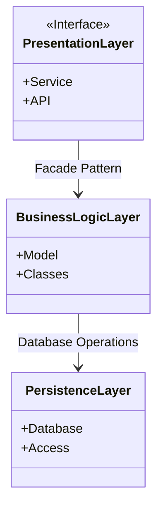
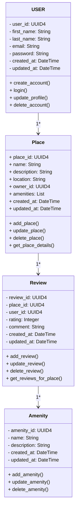

# HBnB Part 1
Part 1 of HBnB and you found diagrams here
---
```
Diagram 1 for Hight-Level Package
```
---

----
----
```
Diagram 2 Detailed Class Diagram for Business Logic
```
---

---------------------------------------------------------------

---------------------------------------------------------------
```
Diagram 3 Sequence Diagrams for API Calls
```
---
```mermaid

sequenceDiagram
    participant Client
    participant API
    participant User Model
    participant Place Model
    participant Database

    Client ->> API: POST REQUEST
    API ->> User Model: CHECK USER
	API ->> Place Model: VALIDATE DATA
	Place Model ->> Database: SAVE DATA
	Database ->> Place Model: SAVING CONFIRMATION
    Place Model ->> API: SEND NEW PLACE
	API ->> Client: CREATED

